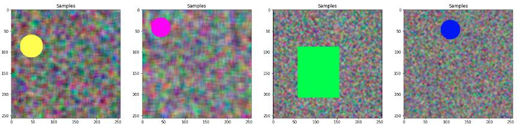
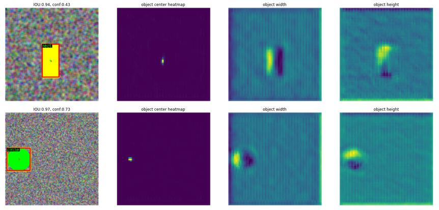

### Centernet tiny


Centernet [1] is a point-based detector, that works without anchor-box proposals. This type of implementation eliminates the post-processing part known from Single Shot MultiBox Detectors [2], which usually consumes a lot of resources, therefore the Non-Maximum Suppression can be simplified.

With this approach, the object's center points and other properties (size, bounding box offset, depth, orientation, or others) are regressed, providing a large versatility of detection tasks.

This implementation provides an optimized version with low computational complexity, that can be easily deployed on embedded devices.

```NOTE: This is an unofficial implementation of Centernet, for the original one consult the article [1]``` 

### Architecture

The architecture has the following parts:
1. Backbone - that can be adjusted to the computational complexity needed. currently, slim U-NET [3] is used to generate the necessary features maps
2. Centernet head - that generates Nr of classes + 2 (center point offset) + 2 (width and height), head width, head height heatmaps. Easily can be extended to regress for other type of values, i.e. 3D object detection or human pose detection
 
The implementation has a sample generator, that generates a noisy background and an object with different colors in the foreground, like circles, and rectangles.

<p align="center"> 
  </a>
  <div align="center">Sample generator</div>
</p>

### Results

```
Measurements:
  Total params: 1,029,985
  Backbone computational complexity [FLOPS]: 0.263 G
  Backbone + head computational complexity [FLOPS]: 0.581 G
  IOU: 92.55 %
  Class Accuracy: 100.00 %, 
```

<p align="center"> 
  </a>
  <div align="center">1. Detection results, 2. Centerpoint, 3. Width resgression values, 4. Height regression values</div>
</p>


### Resources
1. [Objects as Points - arXiv:1904.07850 [cs.CV]](
https://doi.org/10.48550/arXiv.1904.07850)
2. [SSD: Single Shot MultiBox Detector - 	arXiv:1512.02325 [cs.CV]](https://doi.org/10.48550/arXiv.1512.02325)
3. [U-Net: Convolutional Networks for Biomedical Image Segmentation - 	arXiv:1505.04597 [cs.CV]](https://arxiv.org/abs/1505.04597)
4. [Focal Loss for Dense Object Detection](https://arxiv.org/pdf/1708.02002.pdf)

/Enjoy.